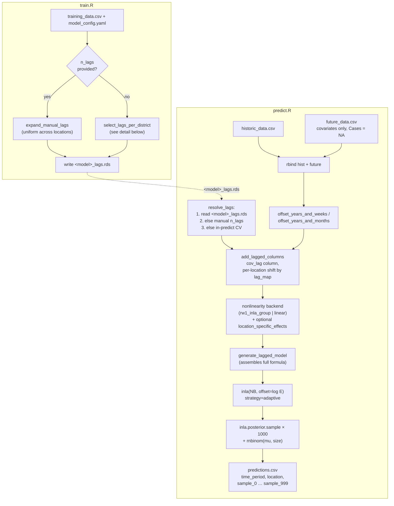
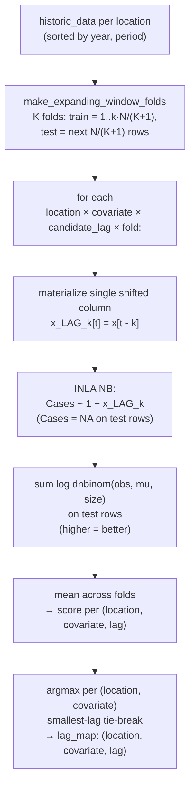

# How `ewars_plus_template` works

## High-level pipeline



`train.R` is **not** a no-op: it resolves the lag map and writes
`<model>_lags.rds` as a companion file. `predict.R` reads it back, so
the CV loop runs once per backtest split rather than once per predict
call.

## Per-(location, covariate) lag selection (CV path only)



## Nonlinearity backends

The lagged-covariate effect is built by a backend function registered in
`lib.R`. Each backend takes the data frame (already carrying the
per-location shifted `<cov>_lag` column), mutates whatever extra columns
it needs, and returns the formula fragments it wants in the linear
predictor. `generate_lagged_model` loops over covariates, calls the
backend per covariate, and assembles the final formula.

Shipped backends:

| Name | Effect added | With `location_specific_effects = TRUE` |
|---|---|---|
| `rw1_inla_group` (default) | `f(inla.group(<cov>_lag), model='rw1', scale.model=TRUE)` — matches ewars_Plus's `selected_Model_form_rw` | parallel `f(..., replicate=ID_spat)` deviation on the same grouped column (global shape + per-location partial-pooled deviation) |
| `linear` | standardised linear term `<cov>_lag_z` (NA→0 imputed for prediction-row safety) | adds `f(ID_spat_<cov>, <cov>_lag_z, model='iid')` — per-location random slope |

Selected via `user_options.nonlinearity` in the model config. Adding a
new backend (crossbasis, splines, GP, …) is a one-function change in
`lib.R`; `predict.R` does not need to change.

## Final INLA formula

```
Cases ~ 1
  + f(ID_spat,        model = "iid",  replicate = ID_year)
  + f(ID_time_cyclic, model = "rw1",  cyclic = TRUE, scale.model = TRUE)
  + <backend term(s) per covariate>                                # see backends table
  [+ <backend's location-specific term(s) per covariate>]          # if location_specific_effects = TRUE
  [+ f(ID_time_cyclic2, model = "rw1", cyclic = TRUE, scale.model = TRUE,
       replicate = ID_spat)]                                        # if region_seasonal = TRUE
```

Family: `nbinomial`. Offset: `log(E)` (population). For the default
`rw1_inla_group` backend the covariate enters only through an RW1
smooth on its `inla.group`'d shifted column — no separate linear term,
matching ewars_Plus's `selected_Model_form_rw`. The `linear` backend
adds a standardised linear term instead.

## Structural correspondence with upstream ewars_Plus

| Concept | ewars_Plus | ewars_plus_template |
|---|---|---|
| Per-district lag candidate columns | `paste0(alarm_vars, "_LAG", Min_lag:Max_lag)` (`Lag_Model_selection_…R:130`) | `add_lagged_columns(df, covariates, lag_map)` |
| Lag selection criterion | INLA-based variable selection (`Sel_Vars`, ~L285) on the full multi-variable formula | per-(location, covariate) expanding-window CV log-score |
| Per-location lags | yes (one selected lag per district per variable) | yes (lag_map keyed by `(location, covariate)`); rows materialise each location's chosen lag into a shared column |
| Final formula | `selected_Model_form_rw` — RW1 smooth on `inla.group`'d selected shifted column | same shape (default `rw1_inla_group` backend); `linear` backend swaps in a standardised linear term |
| Per-district exposure-response shape | implicit, since INLA is fit per district | optional via `location_specific_effects` (per-location deviation, partial-pooled around shared smooth) |
| Predictive sampling | INLA posterior sample → `rnbinom` | INLA posterior sample → `rnbinom` |
| Output rows | sparse subset of requested forecast weeks | one row per `Cases = NA` row of `rbind(historic, future)` |
| Endemic channel / alarms | computed and emitted | **dropped** |
| Container statefulness | trained RDS state in container | only the cached `<model>_lags.rds` companion file written by `train.R`; no fitted model is reused across predict calls |
