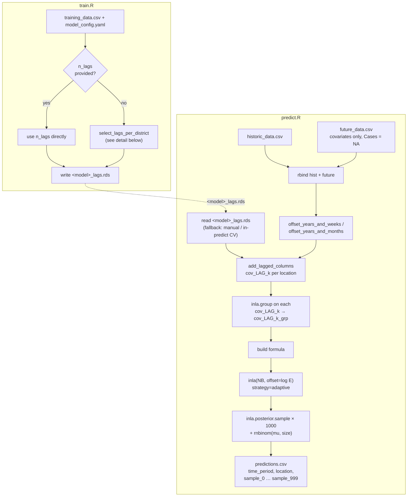
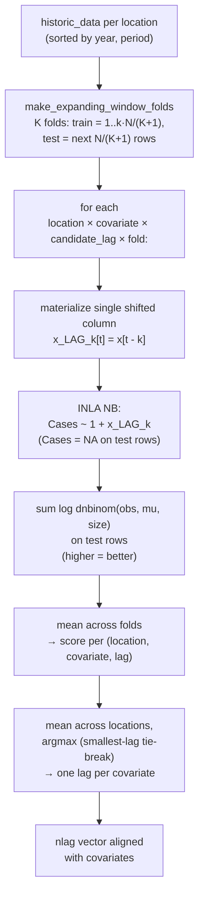

# How `ewars_plus_template` works

## High-level pipeline



## Per-district lag selection (CV path only)



## Final INLA formula

```
Cases ~ 1
  + f(ID_spat,        model = "iid",  replicate = ID_year)
  + f(ID_time_cyclic, model = "rw1",  cyclic = TRUE, scale.model = TRUE)
  + f(<cov_i>_LAG<k_i>_grp, model = "rw1", scale.model = TRUE)   # one term per covariate
  [+ f(ID_time_cyclic2, model = "rw1", cyclic = TRUE, scale.model = TRUE,
       replicate = ID_spat)]                                     # if region_seasonal = TRUE
```

Family: `nbinomial`. Offset: `log(E)` (population). The covariate enters
only through the RW1 smooth on its discretised (`inla.group`) shifted
column — no separate linear term, matching ewars_Plus's
`selected_Model_form_rw`.

## Structural correspondence with upstream ewars_Plus

| Concept | ewars_Plus | ewars_plus_template |
|---|---|---|
| Per-district lag candidate columns | `paste0(alarm_vars, "_LAG", Min_lag:Max_lag)` (`Lag_Model_selection_…R:130`) | `add_lagged_columns(df, covariates, lags)` |
| Lag selection criterion | INLA-based variable selection (`Sel_Vars`, ~L285) on the full multi-variable formula | per-(district, covariate) expanding-window CV log-score |
| Aggregation across districts | implicit (one lag fixed per variable for the joint fit) | mean log-score across districts, argmax with smallest-lag tie-break |
| Final formula | `selected_Model_form_rw` — RW1 smooth on `inla.group`'d selected shifted column | same shape: `f(cov_LAG_k_grp, model='rw1', scale.model=TRUE)` |
| Predictive sampling | INLA posterior sample → `rnbinom` | INLA posterior sample → `rnbinom` |
| Output rows | sparse subset of requested forecast weeks | one row per `Cases = NA` row of `rbind(historic, future)` |
| Endemic channel / alarms | computed and emitted | **dropped** |
| Container statefulness | trained RDS state in container | **none** — train.R is a no-op; predict.R retrains each call |
